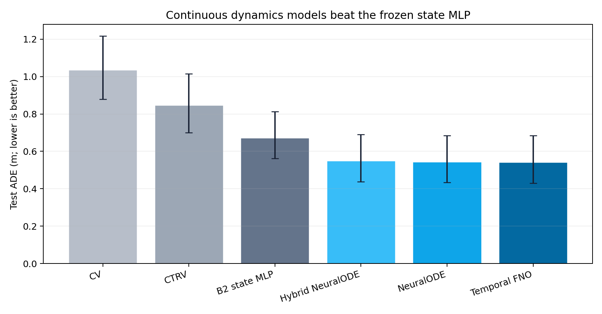
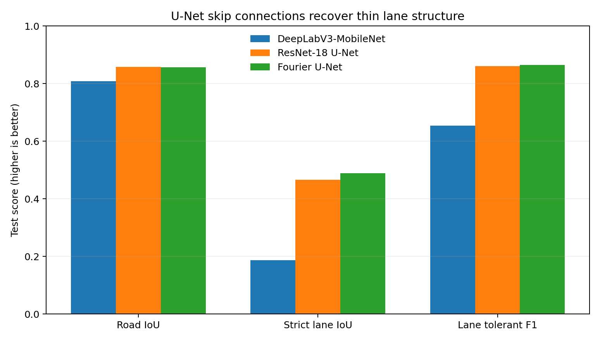

# ZOD Self-Driving Lab

### Deep learning with the Zenseact Open Dataset

I built this as a personal learning project to explore how deep-learning and
physics-based models can solve practical self-driving problems with the Zenseact
Open Dataset (ZOD). I focus on two questions:

1. Can continuous-time or operator-learning models forecast three seconds of
   ego motion better than a strong state MLP?
2. Can an efficient encoder–decoder segment the road surface and thin lane
   markings from a front-camera keyframe?

The answer to both is yes. A temporal Fourier Neural Operator (FNO) reduces
test ADE from **0.673 m to 0.542 m**, and a ResNet-18 U-Net raises the camera
segmentation score from **0.731 to 0.859**. Every learned result uses three
seeds, recording-level splits, validation-only selection, and grouped bootstrap
intervals. Raw ZOD data, masks, checkpoints, and per-sample rows stay external.



## Headline results

### Three-second ego-trajectory forecasting

| Model | Test ADE ↓ | Test FDE ↓ | Miss rate ↓ | Batch-1 GPU latency |
|---|---:|---:|---:|---:|
| Constant velocity | 1.036 | 2.732 | 0.463 | — |
| CTRV | 0.849 | 2.268 | 0.380 | — |
| Frozen B2 state MLP | 0.673 | 1.708 | 0.278 | 0.20 ms |
| Hybrid physics NeuralODE | 0.551 | 1.525 | 0.244 | 35.96 ms |
| NeuralODE | 0.544 | 1.501 | 0.237 | 24.45 ms |
| **Temporal FNO** | **0.542** | **1.486** | **0.235** | **2.69 ms** |

Temporal FNO minus B2 is **−0.131 m ADE**, with a 95% recording-bootstrap
interval of **[−0.155, −0.108] m**. The hybrid ODE is scientifically useful but
does not beat the generic ODE; hand-specified kinematics stabilize the model,
yet they also restrict the learned vector field. FNO provides essentially the
same accuracy as NeuralODE at about one ninth of its latency.

### Road and lane segmentation

| Model | Road IoU ↑ | Strict lane IoU ↑ | Lane tolerant F1 ↑ | Score ↑ | Params | Latency |
|---|---:|---:|---:|---:|---:|---:|
| DeepLabV3-MobileNet | 0.809 | 0.187 | 0.654 | 0.731 | 11.0M | 3.20 ms |
| **ResNet-18 U-Net** | **0.858** | 0.466 | 0.861 | 0.859 | **14.4M** | **2.93 ms** |
| Fourier U-Net | 0.856 | **0.489** | **0.865** | **0.861** | 56.8M | 4.99 ms |

Both U-Nets improve the per-image score over DeepLab by about **+0.136**, with
95% intervals fully above zero. Fourier U-Net minus ordinary U-Net is only
**+0.0010**, interval **[−0.0072, +0.0094]**. I therefore promote the ordinary
U-Net: the Fourier bottleneck is an informative control, not an efficiency win.



## What is unusual about the project

- **True multiple shooting.** NeuralODE training solves three shorter initial
  value problems, penalizes boundary discontinuities, and retains an
  uninterrupted full-rollout objective. Future-derived shooting states exist
  only inside training loss code.
- **Physics is an ablation, not decoration.** The hybrid state is
  \([x,y,\psi,v,r]\); \(\dot x=v\cos\psi\), \(\dot y=v\sin\psi\), and
  \(\dot\psi=r\) are exact. Only bounded acceleration and yaw acceleration are
  learned.
- **The test roles were sealed.** Dynamics kept the original 72-recording test
  role. Segmentation preserves the old validation role and creates a fresh
  51-recording test subset exclusively from previously unobserved training
  examples.
- **Thin structures get the right metric.** Lane markings are reported with
  strict IoU and a three-pixel tolerance F1; thresholds are fitted independently
  for road and lane using validation only.
- **Negative complexity results remain visible.** Fourier U-Net is larger and
  slower without a reliable aggregate gain. The repository keeps that finding,
  but does not keep the old implementation sprawl that led nowhere.

## Learn the project in order

The executed notebooks are the main teaching surface:

| Notebook | What it teaches |
|---|---|
| `00_project_map.ipynb` | Claims, experimental contracts, and how to read the evidence |
| `01_geometry_splits_and_baselines.ipynb` | Local SE(2), causal windows, group splits, CV and CTRV |
| `02_neural_ode_and_multiple_shooting.ipynb` | ODE states, RK4, multiple shooting, and hybrid physics |
| `03_fourier_operators.ipynb` | Spectral convolution, temporal FNO, and accuracy–latency trade-offs |
| `04_road_lane_segmentation.ipynb` | U-Net skips, Fourier bottlenecks, class imbalance, thin-lane metrics |
| `05_interview_capstone.ipynb` | Defensible claims, failure analysis, and interview questions |

The mathematical reference is [methods.md](docs/methods.md), the exact data and
evaluation contract is [data_and_evaluation.md](docs/data_and_evaluation.md),
and concise interview rehearsal is in
[interview_guide.md](docs/interview_guide.md).

## Reproduce

Create an environment and install the project:

```powershell
python -m venv .venv
.venv\Scripts\python -m pip install -e ".[all]"
```

ZOD access must be requested from Zenseact. The repository never contains or
redistributes raw data. The benchmark pipeline is intentionally explicit:

```powershell
# 1. Materialize train/validation tensors outside the repository.
.venv\Scripts\python scripts\build_v4_dynamics_cache.py `
  --data-root D:\datasets\zod `
  --manifest-dir D:\private\zod-parent-manifest `
  --reference-checkpoint D:\private\b2-seed-2026-best.pt `
  --output D:\datasets\zod-v4-private\dynamics_selection

# 2. Train all three models × three seeds on CUDA.
.venv\Scripts\python scripts\train_v4_dynamics.py `
  --cache D:\datasets\zod-v4-private\dynamics_selection `
  --output D:\datasets\zod-v4-private\dynamics_runs `
  --device cuda

# Segmentation has the analogous build/train/evaluate scripts.
```

The public evidence is in [RESULTS.md](reports/RESULTS.md) and the machine-readable
[benchmark summary](reports/benchmark_summary.json). Exact private paths are
arguments, never committed configuration.

## Scope and limitations

This is an offline ego-trajectory and camera-segmentation study, not an end-to-end
driving policy. The trajectory model uses vehicle state rather than camera
features. Segmentation has only 489 labeled keyframes and 51 final test
recordings; it measures road/lane masks, not instance or panoptic perception.
The statistically reliable findings are the gains over B2 and DeepLab—not the
tiny differences between FNO and NeuralODE or between the two U-Nets.

ZOD is provided by Zenseact. Dataset terms and attribution remain governed by
the official ZOD license and documentation.
