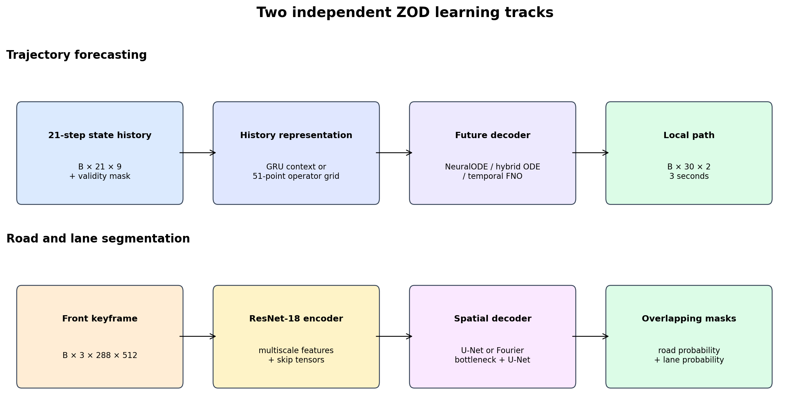
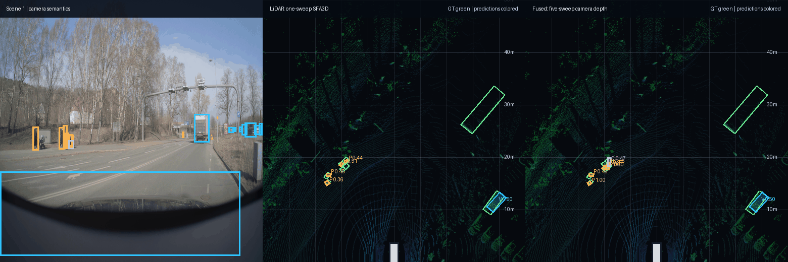
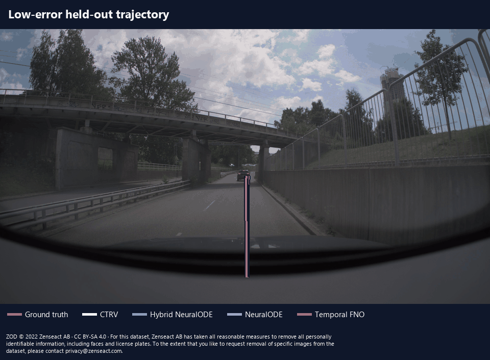
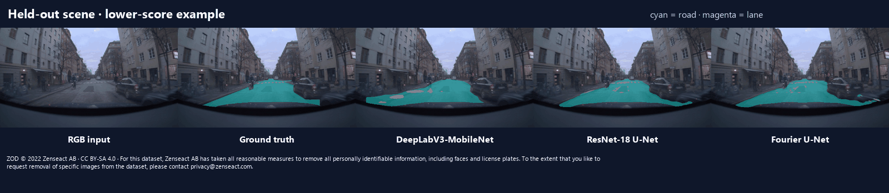
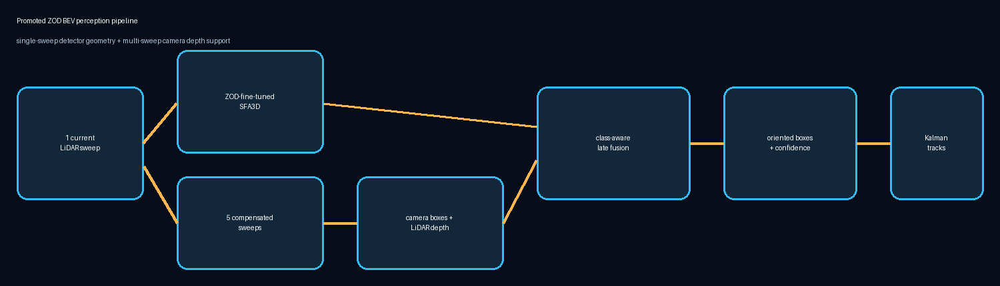
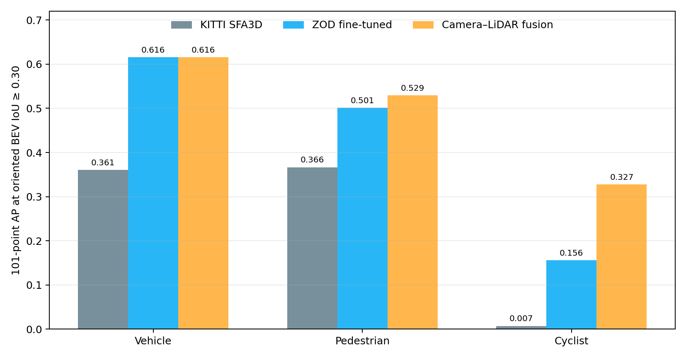
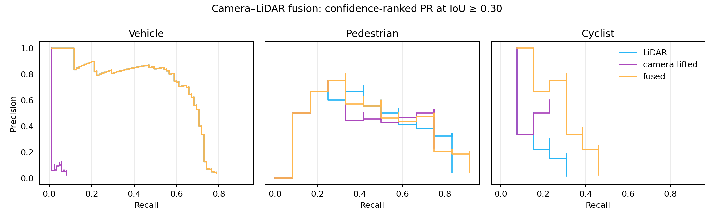

# ZOD Self-Driving Lab

### Deep learning with the Zenseact Open Dataset

I built this as a personal learning project to explore how deep learning,
geometry, and physics-based models can solve practical self-driving problems
with the Zenseact Open Dataset (ZOD). I focus on three questions:

1. Can continuous-time or operator-learning models forecast three seconds of
   ego motion better than a strong state MLP?
2. Can an efficient encoder–decoder segment the road surface and thin lane
   markings from a front-camera keyframe?
3. Can ZOD fine-tuning and calibrated camera–LiDAR fusion produce a useful
   top-down detector for vehicles and vulnerable road users?

The trajectory and segmentation studies have sealed three-seed tests: a
temporal Fourier Neural Operator (FNO) reduces trajectory ADE from **0.673 m to
0.542 m**, and a ResNet-18 U-Net raises camera-segmentation score from **0.731
to 0.859**. The BEV study starts from a failed 12-frame KITTI→ZOD transfer, then
uses protected recording splits to fine-tune SFA3D and add camera semantics.
The final hybrid reaches AP@0.30 of **0.616 vehicle, 0.530 pedestrian, and 0.328
cyclist**, while a vehicle pass-through rule prevents camera fusion from
degrading the LiDAR vehicle branch.






## Headline results

### Three-second ego-trajectory forecasting

| Model | Test ADE ↓ | Test FDE ↓ | Miss rate ↓ | Batch-1 GPU latency |
|---|---:|---:|---:|---:|
| Constant velocity | 1.036 | 2.732 | 0.463 | — |
| CTRV | 0.849 | 2.268 | 0.380 | — |
| Frozen B2 state MLP | 0.673 | 1.708 | 0.278 | 0.20 ms |
| Hybrid physics NeuralODE | 0.551 | 1.525 | 0.244 | 35.96 ms |
| NeuralODE | 0.544 | 1.501 | 0.237 | 24.45 ms |
| **Temporal FNO** | **0.542** | **1.486** | **0.235** | **2.69 ms** |

Temporal FNO minus B2 is **−0.131 m ADE**, with a 95% recording-bootstrap
interval of **[−0.155, −0.108] m**. The hybrid ODE is scientifically useful but
does not beat the generic ODE; hand-specified kinematics stabilize the model,
yet they also restrict the learned vector field. FNO provides essentially the
same accuracy as NeuralODE at about one ninth of its latency.



The animation projects ground truth, CTRV, and the three learned paths through
the calibrated front camera. It is a qualitative interpretation layer: the
trajectory networks receive only the causal 21-step vehicle-state history, not
the camera image. Each learned curve is the mean of three frozen-seed paths. A
four-scene comparison is available as a
[full-resolution static figure](reports/figures/dynamics_camera_predictions.png).

### Road and lane segmentation

| Model | Road IoU ↑ | Strict lane IoU ↑ | Lane tolerant F1 ↑ | Score ↑ | Params | Latency |
|---|---:|---:|---:|---:|---:|---:|
| DeepLabV3-MobileNet | 0.809 | 0.187 | 0.654 | 0.731 | 11.0M | 3.20 ms |
| **ResNet-18 U-Net** | **0.858** | 0.466 | 0.861 | 0.859 | **14.4M** | **2.93 ms** |
| Fourier U-Net | 0.856 | **0.489** | **0.865** | **0.861** | 56.8M | 4.99 ms |

Both U-Nets improve the per-image score over DeepLab by about **+0.136**, with
95% intervals fully above zero. Fourier U-Net minus ordinary U-Net is only
**+0.0010**, interval **[−0.0072, +0.0094]**. I therefore promote the ordinary
U-Net: the Fourier bottleneck is an informative control, not an efficiency win.




Each animation frame keeps the RGB input and ground truth beside all three
frozen model outputs. Cyan marks road and magenta marks lane. The fixed sample
rules include score quantiles and model-disagreement cases rather than only
attractive scenes; predictions use seed 2026 and validation-fitted thresholds.
The first three scenes are also available as a
[full-resolution static montage](reports/figures/segmentation_model_comparison.png).

### LiDAR BEV object detection and tracking



| Sealed AP at oriented IoU ≥ 0.30 | Vehicle | Pedestrian | Cyclist |
|---|---:|---:|---:|
| Unmodified KITTI SFA3D | 0.361 | 0.366 | 0.007 |
| ZOD fine-tuned SFA3D, one sweep | **0.616** | 0.501 | 0.156 |
| **Hybrid camera–LiDAR fusion** | **0.616** | **0.530** | **0.328** |
| PointPillars, trained from scratch | 0.018 | 0.000 | 0.000 |
| CenterPoint head, trained from scratch | 0.000 | 0.000 | 0.000 |

The protected cohort contains 70 training, 16 validation, and 30 sealed test
ZOD Sequence recordings. Every recording contributes only its annotated central
keyframe; all mini recordings are excluded. SFA3D is initialized from the
pinned KITTI checkpoint, first trains only its heads, then progressively
unfreezes the feature pyramid and backbone. Class-balanced sampling counters the
much lower pedestrian and cyclist frequency.



The promoted detector uses one current LiDAR sweep. A five-sweep detector input
looked attractive but reduced validation macro-F1 because ego compensation
cannot remove trails from independently moving objects. Five compensated sweeps
are instead used only to estimate metric depth for camera detections. Unmatched
camera pedestrians and cyclists may supplement LiDAR; vehicle boxes and scores
remain a strict LiDAR pass-through.



Evaluation includes 101-point AP at IoU 0.30/0.50/0.70, precision–recall curves,
confidence calibration, center/yaw/size error, and near/mid/far range slices.
PointPillars and CenterPoint are retained only as small-data controls: training
from scratch on 70 recordings overfits and is not competitive with transfer
learning. The earlier 12-frame mini transfer remains a historical smoke test,
not the headline result.

## What is unusual about the project

- **True multiple shooting.** NeuralODE training solves three shorter initial
  value problems, penalizes boundary discontinuities, and retains an
  uninterrupted full-rollout objective. Future-derived shooting states exist
  only inside training loss code.
- **Physics is an ablation, not decoration.** The hybrid state is
  \([x,y,\psi,v,r]\); \(\dot x=v\cos\psi\), \(\dot y=v\sin\psi\), and
  \(\dot\psi=r\) are exact. Only bounded acceleration and yaw acceleration are
  learned.
- **The test roles were sealed.** Dynamics kept the original 72-recording test
  role. Segmentation preserves the old validation role and creates a fresh
  51-recording test subset exclusively from previously unobserved training
  examples.
- **Thin structures get the right metric.** Lane markings are reported with
  strict IoU and a three-pixel tolerance F1; thresholds are fitted independently
  for road and lane using validation only.
- **Negative complexity results remain visible.** Fourier U-Net is larger and
  slower without a reliable aggregate gain. The repository keeps that finding,
  but does not keep the old implementation sprawl that led nowhere.
- **Cross-domain failure drives the next experiment.** The frozen mini transfer
  misses every vulnerable road user; protected ZOD fine-tuning and class-gated
  camera fusion turn that failure into measurable pedestrian/cyclist AP.
- **Metric geometry stays explicit.** ZOD sensor calibration, ego-frame axes,
  oriented polygon IoU, Kalman state transitions, and every raster convention
  are implemented and tested rather than buried inside a visualization.

## Learn the project in order

The executed notebooks are the main teaching surface:

| Notebook | What it teaches |
|---|---|
| `00_project_map.ipynb` | Raw-to-evidence workflow, tensor contracts, experiment ledger, and measured claims |
| `01_geometry_splits_and_baselines.ipynb` | Signal synchronization, missingness, train-only normalization, local SE(2), group splits, CV, and CTRV |
| `02_neural_ode_and_multiple_shooting.ipynb` | GRU context, continuous states, RK4, multiple-shooting supervision, losses, and hybrid vehicle physics |
| `03_fourier_operators.ipynb` | DFT intuition, spectral convolution tensors, causal query grids, temporal FNO, padding, and accuracy–latency trade-offs |
| `04_road_lane_segmentation.ipynb` | Polygon rasterization, resize/augmentation rules, normalized batches, U-Net skips, imbalance, thresholds, and thin-lane metrics |
| `05_lidar_bev_detection_and_tracking.ipynb` | Point-cloud validation, SE(3), BEV rasterization, heatmap targets, temporal sweeps, transfer learning, fusion, AP/calibration, and tracking |
| `06_project_synthesis.ipynb` | A personal end-to-end reconstruction of the data paths, comparisons, failure analysis, and implementation map |

The mathematical reference is [methods.md](docs/methods.md), the exact data and
evaluation contract is [data_and_evaluation.md](docs/data_and_evaluation.md),
and the conclusions I use when returning to the work are in
[project_learning_review.md](docs/project_learning_review.md).

## Reproduce

Create an environment and install the project:

```powershell
python -m venv .venv
.venv\Scripts\python -m pip install -e ".[all]"
```

ZOD access must be requested from Zenseact. The repository never contains or
redistributes raw data. The benchmark pipeline is intentionally explicit:

```powershell
# 1. Materialize train/validation tensors outside the repository.
.venv\Scripts\python scripts\build_v4_dynamics_cache.py `
  --data-root D:\datasets\zod `
  --manifest-dir D:\private\zod-parent-manifest `
  --reference-checkpoint D:\private\b2-seed-2026-best.pt `
  --output D:\datasets\zod-v4-private\dynamics_selection

# 2. Train all three models × three seeds on CUDA.
.venv\Scripts\python scripts\train_v4_dynamics.py `
  --cache D:\datasets\zod-v4-private\dynamics_selection `
  --output D:\datasets\zod-v4-private\dynamics_runs `
  --device cuda

# Segmentation has analogous build/train/evaluate scripts.
```

The BEV study additionally uses the official MIT-licensed SFA3D source and
checkpoint outside this repository. Pinning the recorded commit avoids silently
changing the starting model:

```powershell
git clone https://github.com/maudzung/SFA3D.git D:\datasets\zod-sfa3d
git -C D:\datasets\zod-sfa3d checkout 0e2f0b63dc4090bd6c08e15505f11d764390087c

.venv\Scripts\python scripts\cache_bev_training_data.py `
  --zod-root D:\datasets\zod `
  --subset sequences `
  --zod-version full `
  --private-roles D:\private\zod-bev-roles.json `
  --output-dir D:\datasets\zod-bev-cache `
  --sweeps 1

.venv\Scripts\python scripts\train_bev_detectors.py `
  --model sfa3d `
  --cache-root D:\datasets\zod-bev-cache `
  --output-dir D:\private\zod-bev-models `
  --sfa3d-root D:\datasets\zod-sfa3d `
  --sfa3d-checkpoint D:\datasets\zod-sfa3d\checkpoints\fpn_resnet_18\fpn_resnet_18_epoch_300.pth `
  --device cuda
```

The public evidence is in [RESULTS.md](reports/RESULTS.md) and the machine-readable
[benchmark summary](reports/benchmark_summary.json). Exact private paths are
arguments, never committed configuration.

## Scope and limitations

This is an offline trajectory, segmentation, and perception laboratory—not an
end-to-end driving policy. It does not perform navigation, collision-aware path
planning, behavior prediction, or closed-loop control. The trajectory model uses
vehicle state rather than camera or BEV features. Segmentation has only 489
labeled keyframes and 51 final test recordings. The BEV cohort is larger than
the original mini diagnostic but still only 116 locally complete annotated
Sequence recordings; a full-Frames confirmation remains future work. The
statistically reliable findings are the gains over B2 and DeepLab—not the tiny
differences between FNO and NeuralODE or between the two U-Nets.

## ZOD attribution

ZOD is © 2022 Zenseact AB and is licensed under
[CC BY-SA](https://creativecommons.org/licenses/by-sa/4.0/). Dataset terms and
attribution remain governed by the [official ZOD license](https://zod.zenseact.com/license/).

> For this dataset, Zenseact AB has taken all reasonable measures to remove all
> personally identifiable information, including faces and license plates. To
> the extent that you like to request removal of specific images from the
> dataset, please contact privacy@zenseact.com.

The displayed derivatives and their terms are listed in the complete
[visual-asset notice](reports/figures/ZOD_ASSET_NOTICE.md).
