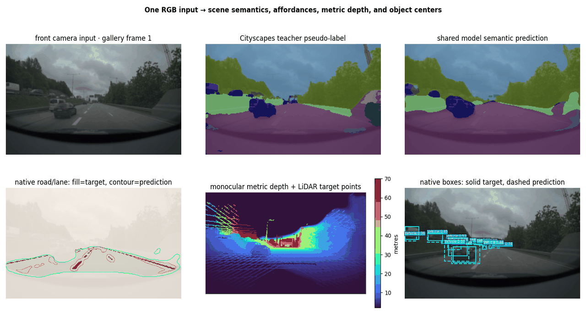
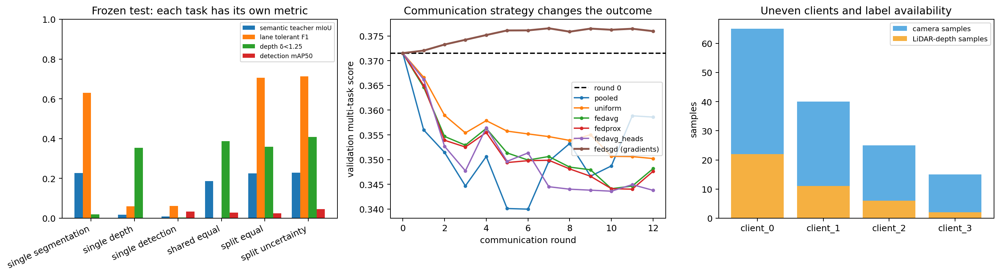

# Frozen benchmark results

## Decision summary

- **Promote temporal FNO for state-based trajectory forecasting.** It ties the
  best accuracy, improves ADE by 0.131 m over B2, and is much faster than either
  ODE.
- **Retain hybrid NeuralODE as the interpretable physics study.** It reliably
  improves B2 but does not beat the less constrained alternatives.
- **Promote ResNet-18 U-Net for affordance segmentation.** It captures almost
  all Fourier U-Net accuracy with one quarter of the parameters.
- **Promote the hybrid BEV system.** A ZOD-fine-tuned, single-sweep SFA3D branch
  supplies metric geometry; calibrated five-sweep camera depth lifting adds
  pedestrian and cyclist proposals. Vehicle predictions pass through unchanged.
- **Retain PointPillars, CenterPoint, and five-sweep detector input as negative
  controls.** They show that architecture names and extra points do not replace
  transfer learning or correct temporal treatment on a small cohort.
- **Promote the split-decoder camera model and its round-7 FedSGD update.**
  Shared encoding reduces the three-network parameter total by about 54% while
  task-specific decoders avoid the hard-shared lane collapse. Local-optimizer
  deltas drift below round zero; sample-weighted mean gradients improve the
  registered composite score.

## Dynamics

Three-seed means on 2,549 windows / 72 recording groups:

| Model | ADE | FDE | Miss >2m | Parameters | Median latency |
|---|---:|---:|---:|---:|---:|
| B2 state MLP | 0.6732 | 1.7082 | 0.2776 | 112,444 | 0.196 ms |
| Hybrid NeuralODE | 0.5507 | 1.5245 | 0.2438 | 108,674 | 35.956 ms |
| NeuralODE | 0.5435 | 1.5007 | 0.2367 | 108,162 | 24.450 ms |
| Temporal FNO | **0.5424** | **1.4864** | **0.2346** | 1,230,242 | **2.689 ms** |

Paired ADE differences versus B2:

| Candidate - B2 | Estimate | 95% recording bootstrap |
|---|---:|---:|
| Hybrid NeuralODE | -0.1226 | [-0.1475, -0.0971] |
| NeuralODE | -0.1297 | [-0.1550, -0.1046] |
| Temporal FNO | **-0.1308** | **[-0.1546, -0.1080]** |

## Segmentation

Three-seed global metrics on the fresh 51-recording test role:

| Model | Road IoU | Lane IoU | Lane tolerant F1 | Score | Parameters | Median latency |
|---|---:|---:|---:|---:|---:|---:|
| DeepLabV3-MobileNet | 0.8087 | 0.1871 | 0.6542 | 0.7314 | 11.0M | 3.198 ms |
| ResNet-18 U-Net | **0.8579** | 0.4663 | 0.8609 | 0.8594 | **14.4M** | **2.932 ms** |
| Fourier U-Net | 0.8564 | **0.4892** | **0.8651** | **0.8608** | 56.8M | 4.995 ms |

Per-image paired score differences:

| Comparison | Estimate | 95% recording bootstrap |
|---|---:|---:|
| U-Net - DeepLab | +0.1355 | [+0.1165, +0.1560] |
| Fourier U-Net - DeepLab | +0.1365 | [+0.1179, +0.1577] |
| Fourier U-Net - U-Net | **+0.0010** | **[-0.0072, +0.0094]** |

## LiDAR-camera BEV detection

The protected ZOD Sequences cohort contains 70 train, 16 validation, and 30
sealed test recordings. Roles are recording-disjoint, exclude the mini subset,
and require a front image, LiDAR, calibration, ego motion, and 3-D labels.
Model, sweep count, checkpoints, and confidence thresholds were chosen using
train/validation only.

Test average precision uses 101-point interpolation and class-consistent,
one-to-one oriented-BEV matching:

| Model | Vehicle AP@0.30 | Pedestrian AP@0.30 | Cyclist AP@0.30 |
|---|---:|---:|---:|
| Unmodified KITTI SFA3D | 0.361 | 0.366 | 0.007 |
| ZOD fine-tuned SFA3D, one sweep | **0.616** | 0.501 | 0.156 |
| **Hybrid LiDAR-camera fusion** | **0.616** | **0.529** | **0.327** |
| PointPillars, from scratch | 0.018 | 0.000 | 0.000 |
| CenterPoint head, from scratch | 0.000 | 0.000 | 0.000 |

The hybrid deliberately passes Vehicle detections and confidence through
unchanged. Camera proposals can supplement only Pedestrian and Cyclist, so the
vehicle AP equality is guaranteed by construction rather than inferred from a
rounded number. Pedestrian AP increases by 0.028 and cyclist AP by 0.172.

At stricter IoU thresholds, the fused AP values are:

| Class | AP@0.30 | AP@0.50 | AP@0.70 |
|---|---:|---:|---:|
| Vehicle | 0.616 | 0.398 | 0.222 |
| Pedestrian | 0.529 | 0.361 | 0.067 |
| Cyclist | 0.327 | 0.071 | 0.071 |

Five ego-motion-compensated sweeps are useful for estimating camera-object
depth, but feeding them directly to the detector reduced validation macro-F1.
Static structure aligns while moving objects leave trails. The promoted design
therefore uses one sweep for detection and five sweeps only inside the
foreground-depth estimator.

## Multi-task camera perception and federated learning

The camera study uses 220 centralized examples, four non-IID collection-car
clients with 65/40/25/15 examples, 73 validation examples, and 51 test examples.
Scene semantics are SegFormer Cityscapes pseudo-labels; road/lane, sparse depth,
and 2-D boxes use native ZOD geometry.

| Frozen model | Params | Teacher mIoU | Lane tolerant F1 | Depth δ1 | 2-D mAP50 |
|---|---:|---:|---:|---:|---:|
| Single segmentation | 14.48M | **0.228** | 0.630 | — | — |
| Single depth | 14.48M | — | — | 0.354 | — |
| Single detection | 14.48M | — | — | — | **0.034** |
| Hard-shared, equal | **14.48M** | 0.187 | 0.000 | **0.387** | 0.029 |
| **Split decoder, equal** | **19.80M** | 0.225 | **0.705** | 0.358 | 0.025 |
| Split decoder, uncertainty | 19.80M | 0.228 | 0.713 | 0.409 | 0.046 |

The uncertainty model has stronger raw test values but was not selected: equal
weighting had the higher frozen validation score. The selected split-equal
model is the defensible one-pass compromise. It is 4.7 ms at batch one versus
about 9.1 ms for the three separate controls in sequence.

Sample-weighted FedAvg uses client weights 0.448/0.276/0.172/0.103. Uniform
averaging, FedProx (μ=0.001), pooled fine-tuning, and encoder-frozen FedAvg are
controls. At the low-drift learning rate every local-optimizer method selects
round zero; the centralized validation score is 0.372 and their best updated
score is 0.367.

FedSGD transmits each client's mean parameter gradient evaluated at the same
global checkpoint. A validation-only server-rate sweep selects η=0.003 and
round 7, increasing validation from 0.3715 to 0.3765. Frozen test results are:

| FedSGD selection | Composite score | Teacher mIoU | Lane tolerant F1 | Depth δ1 | 2-D mAP50 |
|---|---:|---:|---:|---:|---:|
| Round 0 | 0.3392 | 0.2252 | 0.7053 | 0.3586 | 0.0252 |
| **Round 7** | **0.3445** | 0.2254 | 0.7044 | **0.3824** | 0.0232 |

The registered composite rule promotes round 7, but the per-task table makes
the trade explicit. Dense FP32 gradients and model deltas both contain about
75.5 MiB per full-model client; neither message is compressed or private by
construction.

## Evidence files

- `v4_dynamics_test.json`: seed metrics, grouped intervals, latency, and hashes.
- `v4_segmentation_test.json`: thresholds, metrics, paired improvements, and hashes.
- `bev_protected_roles.json`: privacy-preserving role counts and ID-set hashes.
- `bev_v2_summary.json`: consolidated aggregate BEV metrics and selection record.
- `multitask_federated_data.json`: uneven client and task-label coverage without IDs.
- `multitask_central_test.json`: single, hard-shared, and split-decoder benchmark.
- `multitask_federated_test.json`: round-zero-aware federated selection and communication.
- `multitask_fedsgd_lr*_validation.json`: server-rate selection without test reads.
- `multitask_fedsgd_test.json`: validation-selected gradient-only update and frozen test result.
- `benchmark_summary.json`: consolidated dynamics/segmentation learning curves.
- `figures/`: aggregate plots and attributed qualitative ZOD derivatives.

Raw ZOD assets, identifiers, checkpoints, caches, and per-frame predictions are
not distributed by this repository.
